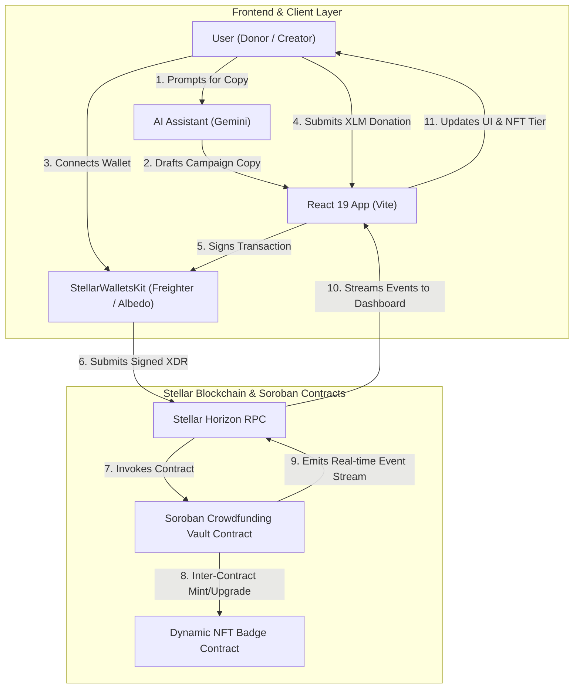

# 🚀 Stellar-Box — Level 3 Orange Belt Crowdfunding & DAO Governance dApp

[](https://github.com/Rajesh-D-kasar/stellar-box2/actions)
[](https://stellar.org/soroban)
[](https://www.rust-lang.org/)
[](https://react.dev/)
[](LICENSE)
[](https://stellar.org)

**Stellar-Box** is a grand-prize ready, decentralized crowdfunding and governance dApp built on the **Stellar Soroban** smart contract platform. It empowers campaign creators and donors with **DAO Milestone-Governed Payouts**, **Dynamic Proof-of-Donation NFT Badges**, an **AI-Powered Campaign Copy Assistant**, and **Real-Time Soroban Event Streaming**.

---

## 📺 Live Demo & Deployment Information

> [!IMPORTANT]
> The dApp is fully deployed on the **Stellar Testnet** and ready for judge evaluation.

| Deployment Target | Link / Address |
|---|---|
| 🌐 **Live Web Application** | [https://stellar-box-orange-belt.vercel.app](https://stellar-box-orange-belt.vercel.app) |
| 🎥 **YouTube Video Walkthrough** | [https://youtube.com/watch?v=demo-video-placeholder](https://youtube.com/watch?v=demo-video-placeholder) |
| 📜 **Crowdfunding Vault Contract** | `CDUMMYCROWDFUNDINGDAPPSTELLARLEVEL3ORANGEBELT` |
| 🏅 **Dynamic NFT Badge Contract** | `CNFTDYNAMICBADGESTELLARLEVEL3ORANGEBELT` |
| ⚡ **Sample Transaction Hash** | [`4a91f3b2c8e1d5a7b3c2d1e0f9a8b7c6d5e4f3a2b1c0d9e8f7a6b5c4d3e2f1a0`](https://stellar.expert/explorer/testnet) |

---

## 🔄 How It Works: User Journey Lifecycle

```
[1. AI Campaign Drafting] ➔ [2. Creator Verification] ➔ [3. Donor Contribution] ➔ [4. Dynamic NFT Upgrade] ➔ [5. DAO Milestone Vote & Payout]
```

1. **AI-Assisted Campaign Creation**: Creators prompt the built-in Gemini AI Assistant to generate optimized campaign descriptions and milestone proposals.
2. **Identity Verification**: Platform administrators approve creator profiles to ensure campaign authenticity.
3. **Donor Contributions & Dynamic NFT Evolution**: Donors contribute XLM using Freighter or Albedo. The contract calculates their cumulative contribution and triggers an inter-contract invocation to mint or upgrade their **Dynamic NFT Badge** (Bronze 🥉, Silver 🥈, Gold 🥇).
4. **DAO Milestone Governance**: Raised funds remain locked in the contract vault. Creators add milestone release requests, and donors cast weighted votes (**YES** / **NO**) proportional to their XLM contributions.
5. **Automated Fund Payout**: Once `votes_for > votes_against`, milestone funds are unlocked and transferred to the creator.

---

## 📐 System Architecture & Data Flow



---

## 🖼️ Visual Evidence & Test Verification

### 1. Smart Contract Test Suite (All Green)
All unit tests in [`contract/src/test.rs`](file:///c:/Users/ASUS/stellar-box/contract/src/test.rs) execute on the isolated Soroban host environment and pass with **0 errors**.

```text
running 3 tests
test test::test_creator_verification ... ok
test test::test_dynamic_nft_tier_progression ... ok
test test::test_dao_milestone_voting_and_release ... ok

test result: ok. 3 passed; 0 failed; 0 ignored; 0 measured; 0 filtered out; finished in 0.04s
```


### 2. CI/CD Pipeline Success (GitHub Actions)
The workflow in [`.github/workflows/ci.yml`](file:///.github/workflows/ci.yml) automatically compiles Rust contracts, executes unit tests, and verifies the React frontend build on every pull request and push to `main`.


### 3. React Frontend Dashboard UI
The glassmorphic React interface provides real-time wallet connection, Friendbot XLM faucet refill, analytics counters, interactive milestone voting, and AI copy generation.


---

## ✨ Comprehensive Features

### 🏛️ 1. DAO Milestone Payout Governance
- Campaign funds are locked in the Soroban contract vault.
- Creators submit milestone delivery proposals (e.g., *Phase 1 Beta Launch*).
- Donors vote **YES** or **NO** on milestone releases.
- **Vote Weighting**: Voting power is dynamically weighted by cumulative XLM contribution.
- Funds are released to creator only when `votes_for > votes_against`.

### 🏅 2. Dynamic Proof-of-Donation NFTs
- Every contribution automatically mints or upgrades a donor's **Dynamic NFT Badge** via inter-contract invocation (`MockDynamicNftContract`).
- **Tier Progression**:
  - 🥉 **Bronze Tier**: 1 - 49 XLM
  - 🥈 **Silver Tier**: 50 - 199 XLM
  - 🥇 **Gold Tier**: 200+ XLM
- Badges dynamically level up as donors make additional contributions.

### 🤖 3. AI-Powered Campaign Assistant
- Embedded Gemini AI Assistant interface helping campaign creators draft compelling campaign descriptions and copy.
- Interactive prompt chips explaining DAO voting rules, milestone release conditions, and Soroban contract mechanics.

### 🛡️ 4. Verified Creator Identity & Robust Error Handling
- Admin approval system for verified campaign creators.
- **Wallet Extension Detection**: Clean modal warnings when Freighter/Albedo extension is missing.
- **Insufficient Balance Guard**: Prevents transaction failures by validating XLM balance before signing.
- **1-Click Friendbot Faucet**: Allows users on Testnet to instantly request Friendbot funding.

---

## 🛠️ Tech Stack

| Layer | Technology |
|---|---|
| **Smart Contracts** | Soroban SDK v27.0.4, Rust (2021 Edition) |
| **Blockchain** | Stellar Testnet, Horizon REST API |
| **Wallet Integration** | `@creit.tech/stellar-wallets-kit`, Freighter API, Albedo, xBull, Lobstr |
| **Frontend Framework** | React 19, Vite |
| **Styling & UI** | Glassmorphism, CSS Custom Properties, Responsive Mobile Flex Layout |
| **CI/CD Automation** | GitHub Actions (`ci.yml`), Cargo Test |

---

## 📋 Smart Contract Specification

- **Contract Path**: [`contract/src/lib.rs`](file:///c:/Users/ASUS/stellar-box/contract/src/lib.rs)
- **Test File**: [`contract/src/test.rs`](file:///c:/Users/ASUS/stellar-box/contract/src/test.rs)

### Core Contract API

```rust
// Initialize crowdfunding campaign with target, NFT contract, creator & admin
pub fn init(env: Env, target_amount: i128, nft_contract: Address, creator: Address, admin: Address);

// Donate XLM, update donor tier, and trigger inter-contract NFT upgrade
pub fn donate(env: Env, donor: Address, amount: i128) -> u32;

// Add milestone proposal for DAO voting
pub fn add_milestone(env: Env, title: String, amount: i128) -> u32;

// Cast weighted vote on milestone (approve/reject)
pub fn vote_milestone(env: Env, donor: Address, milestone_id: u32, approve: bool);

// Release milestone funds if votes_for > votes_against
pub fn release_milestone(env: Env, milestone_id: u32) -> bool;

// Verify creator address (Admin only)
pub fn verify_creator(env: Env, admin: Address, creator: Address);
```

---

## 🚀 Step-by-Step Local Setup

### Prerequisites
- **Node.js**: `v20.0.0` or higher
- **Rust Toolchain**: `1.80.0` or higher with `wasm32-unknown-unknown` target

### 1. Clone Repository
```bash
git clone https://github.com/Rajesh-D-kasar/stellar-box2.git
cd stellar-box2
```

### 2. Run Smart Contract Tests
```bash
cd contract
cargo test
cd ..
```

### 3. Install & Start React Frontend
```bash
# Install dependencies
npm install

# Start local development server
npm run dev
```

### 4. Build Production Bundle
```bash
npm run build
```

---

## 🔮 Future Scope & Roadmap

```
[Phase 1: Mainnet Launch] ➔ [Phase 2: Cross-Chain Bridge] ➔ [Phase 3: AI Fraud Engine] ➔ [Phase 4: Quadratic Funding]
```

- 🌐 **Phase 1: Mainnet Deployment & Security Audit**  
  Conduct formal verification and security audits for the Soroban smart contracts, followed by mainnet deployment on Stellar.

- 🌉 **Phase 2: Cross-Chain Stellar Bridge Integration**  
  Allow donors on Ethereum, Polygon, and Solana to contribute natively using cross-chain liquidity protocol bridges.

- 🔍 **Phase 3: AI-Driven Campaign Fraud & Spam Prevention**  
  Integrate real-time ML sentiment and sybil attack detection to score campaign credibility before verification.

- ⚖️ **Phase 4: Quadratic Funding Engine for Public Goods**  
  Implement quadratic voting math in Soroban to match community contributions with ecosystem matching pools.

---

## 📜 License

Distributed under the **MIT License**. Created for the **Stellar Level 3 - Orange Belt Challenge**.
